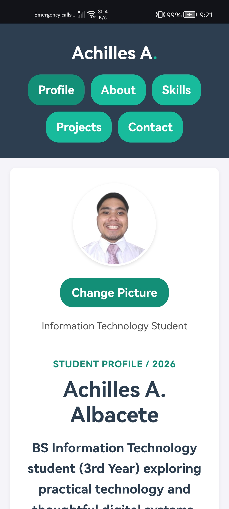
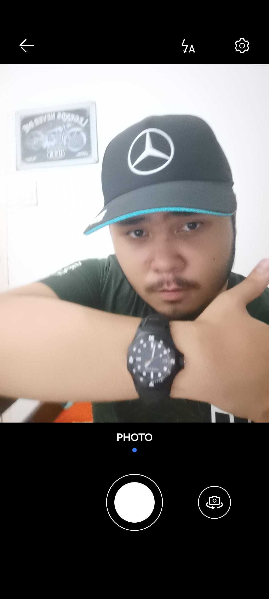
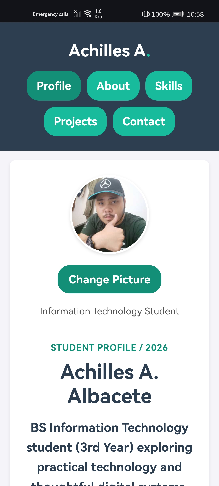
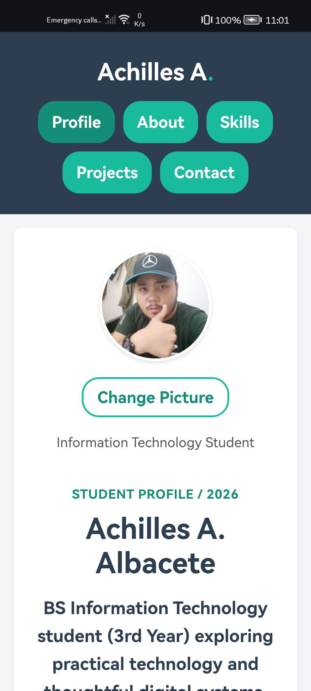

# Achilles Student Profile

## 1. Project Description

This Apache Cordova Android application is a responsive multi-page Student Profile for Achilles A. Albacete, a Bachelor of Science in Information Technology student at Ateneo de Cagayan - Xavier University. It presents personal background, skills, projects, and contact information and includes editable profile data plus camera-based profile photo updates.

## 2. Application Pages

- **Profile (`index.html`):** Displays the profile summary, profile photo, editable information, and the Change Picture camera button.
- **About (`about.html`):** Provides personal background, interests, educational background, and goals.
- **Skills (`skills.html`):** Describes web development, networking, problem-solving, and collaboration skills.
- **Projects (`projects.html`):** Presents academic or personal projects, roles, and technologies used.
- **Contact (`contact.html`):** Provides contact and location information.

Each page uses the same navigation menu and shared stylesheet.

## 3. Profile Editing

The Profile page includes an **Edit Profile** form. A student can update the full name, course, year level, About Me content, About Me details, interests, educational background, goals and aspirations, and skills. **Save Changes** trims and validates the required fields, stores the updated profile, refreshes the visible content immediately, and closes the form. **Cancel** closes the form without applying unsaved edits.

## 4. Camera Integration

Activity 6 uses `cordova-plugin-camera`. Pressing **Change Picture** calls the Cordova camera API with these settings:

- Camera source instead of the photo library
- JPEG encoding, quality 50, and a 500 by 500 target size
- Corrected device orientation
- Base64 data returned directly to the application
- No automatic save to the device photo album

The captured image is shown immediately in the profile image element. The implementation also prevents a duplicate `data:image/jpeg;base64,` prefix when Android returns a value that already contains one.

## 5. Device Feature Integration

The application uses the physical Android device camera through `cordova-plugin-camera`. `www/index.html` loads `cordova.js`, and `www/script.js` waits for Cordova initialization while also supporting browser DOM initialization. On a device without camera access, the app displays an unavailable-camera message. Camera cancellation is ignored without showing an error alert.

## 6. Image Handling

The default profile image is `www/Image/264047587.png`. After a successful capture, JavaScript removes whitespace and line breaks from the returned Base64 value, creates a valid JPEG data URL when necessary, assigns it to the profile image, and saves it in the profile object as `profilePic`. The complete object is serialized to `localStorage` with the key `studentProfile`, so the image remains available after closing and reopening the app.

## 7. Error Handling

The app handles the following cases:

- Missing camera access: displays a camera hardware or permissions message.
- User cancellation: exits quietly when the camera reports cancellation or no image.
- Storage failure: reports that the profile could not be saved on the device.
- Malformed stored JSON: removes the invalid value and restores the default profile.
- Empty required profile fields: shows validation feedback and focuses the invalid field.

## 8. Responsive Design

The shared `www/style.css` stylesheet uses a mobile-first layout, flexible grids, relative spacing, readable type sizes, and responsive breakpoints. The pages adapt to phone, tablet, and desktop screens without horizontal scrolling, overlapping content, distorted images, or cut-off text. Semantic headings, labeled navigation, descriptive image alternative text, and visible focus states support accessibility.

## 9. How to Run

1. Open a terminal in the project directory.
2. Install dependencies with `npm install`.
3. Build the Android application with `cordova build android`.
4. Connect an Android phone with USB debugging enabled, then run `cordova run android --device`.
5. Grant camera permission when Android requests it.
6. To preview the non-camera pages in a browser, run `cordova run browser`.

The Cordova entry point is `www/index.html`. The Android camera workflow must be tested on a device or emulator that provides camera access; browser preview does not reproduce the native camera feature.

## 10. Screenshots

The following Activity 6 screenshots demonstrate camera operation and data persistence on a physical Huawei device:

*Profile page before capture, displaying the default avatar and Change Picture button.*

*The native device camera interface opened after selecting "Change Picture", prompting the user to take a new profile photo.*

*Profile page immediately after taking a photo, rendering the new captured picture.*

*Profile page after closing and reopening the app, demonstrating localStorage persistence.*

### Capture & Deployment Steps:
1. Run the `activity-6-camera` branch on your physical device (`cordova run android --device`).
2. Capture a screenshot of the default Profile page and save it as `activity6_SS/Act6_BEFOREImage.jpg`.
3. Tap **Change Picture**, grant camera permissions, take a photo, confirm it, and capture the updated screen as `activity6_SS/capturedImage.jpg`.
4. Close the app completely, reopen it, and capture the persisted screen as `activity6_SS/PersistedImage.jpg`.
5. Commit all images, merge `activity-6-camera` into `main`, and push both branches to GitHub.

---

### Previous Activity References
- **Activity 5 Captures:** `activity5_SS/`
- **Activity 4 Captures:** `activity4_SS/`
- **Activity 3 Responsive References:** `activity3_SS/`
