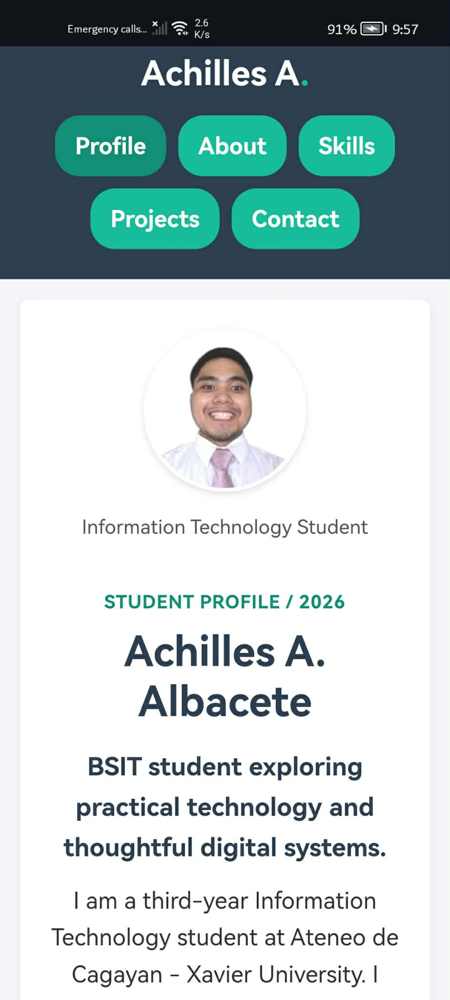
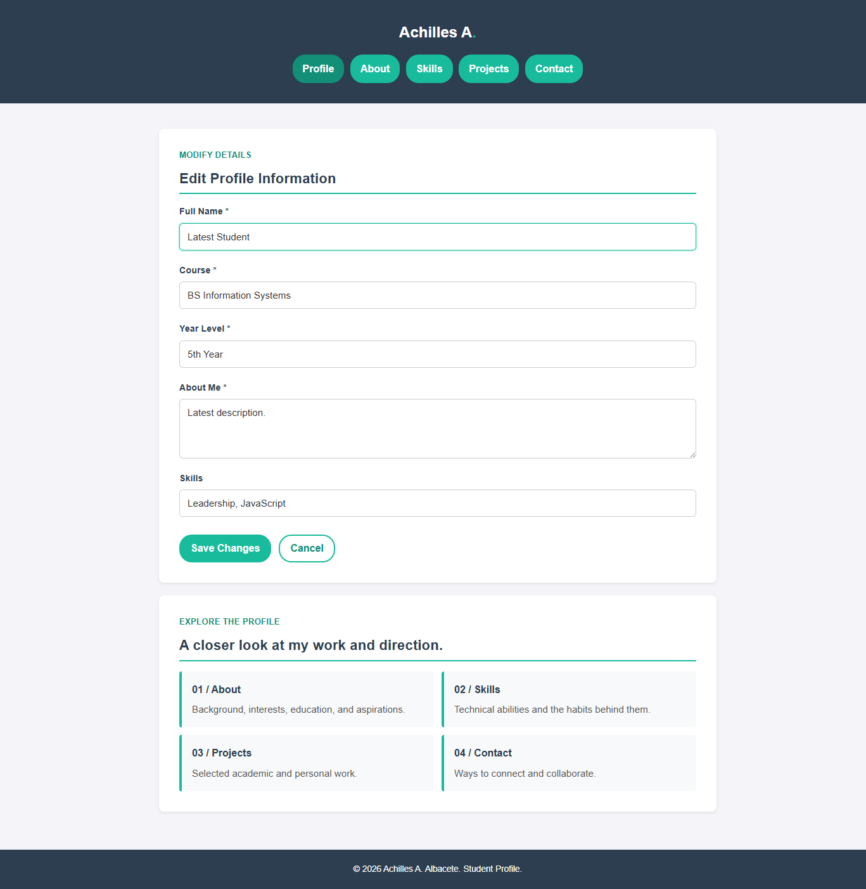
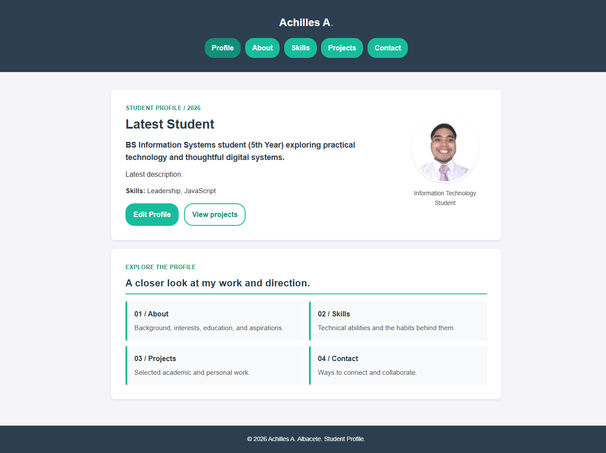
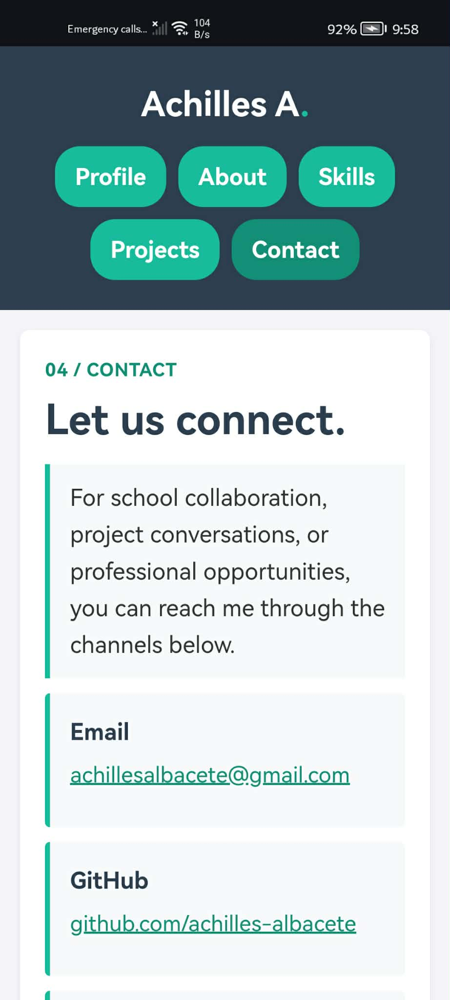
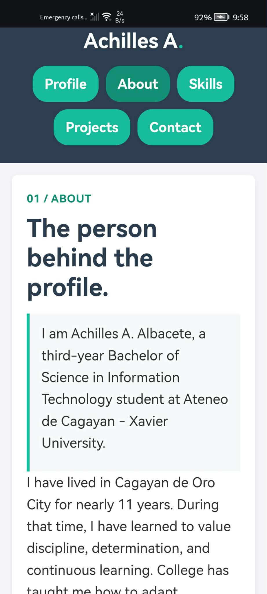
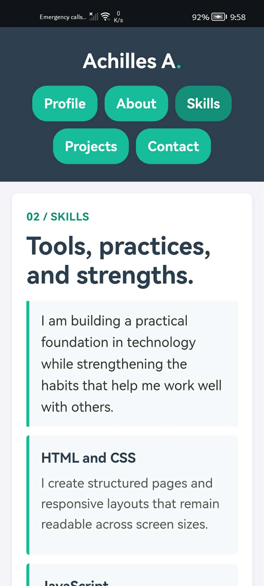
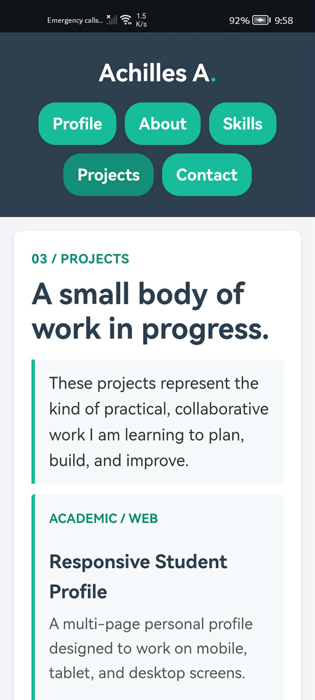

# Achilles Student Profile

## Project Description

This Apache Cordova application is a responsive multi-page Student Profile for Achilles A. Albacete, a Bachelor of Science in Information Technology student at Ateneo de Cagayan - Xavier University. It presents personal background, skills, projects, and contact information in a consistent web experience.

## Application Pages

- **Profile:** The homepage introduces Achilles and links to every part of the profile.
- **About:** Provides personal background, interests, educational background, and goals.
- **Skills:** Describes technical, networking, web development, problem-solving, and collaboration skills.
- **Projects:** Presents three academic or personal projects with roles and technologies used.
- **Contact:** Provides email, GitHub, and location information for collaboration or professional contact.

## Profile Editing

The Profile page includes an **Edit Profile** interface. Students can update their full name, course/program, year level, About Me description, and skills. **Save Changes** validates the required fields, stores the updated profile, refreshes the visible profile content immediately, and closes the form. **Cancel** discards unsaved edits and returns to the profile view.

## JavaScript Functionality

The `www/script.js` file handles form events and DOM manipulation. It opens and closes the edit interface, validates Full Name, Course, Year Level, and About Me, displays specific feedback for invalid fields, updates the profile after a valid Save, and keeps Cancel changes from being applied. It also guards against malformed stored JSON and prevents duplicate setup when Cordova fires its device-ready event.

## Local Data Storage

The profile object is stored as JSON in browser or Android WebView `localStorage` under the `studentProfile` key. On startup, JavaScript retrieves the saved values and displays them. If no saved values exist, the application uses the default profile information in `www/script.js`.

## Navigation

The application uses standard HTML links to navigate between `index.html`, `about.html`, `skills.html`, `projects.html`, and `contact.html`. Every page includes the same navigation menu, and the Profile link provides an easy way to return to the homepage. No JavaScript is used for page navigation.

## Responsive Design

The shared `www/style.css` stylesheet uses a mobile-first layout, flexible grids, relative spacing, readable type sizes, and responsive breakpoints. The five pages adapt to mobile, tablet, and desktop screens without horizontal scrolling, overlapping content, distorted images, or cut-off text.

## UI/UX Principles Applied

- **Consistency:** All pages share the same header, navigation, typography, colors, spacing, cards, and footer.
- **Visual hierarchy:** Page labels, headings, introductory text, and supporting details use distinct sizes and colors.
- **Usability:** The active navigation link shows the current page, while clear links connect users to the next section.
- **Readability:** Content uses a constrained width, comfortable line height, strong contrast, and responsive spacing.
- **Accessibility:** Semantic headings, descriptive image alternative text, labeled navigation, visible focus states, and meaningful links are included.

## How to Run

1. Clone this repository and open a terminal in the project directory.
2. Install dependencies with `npm install`.
3. Build Android with `cordova build android`.
4. Run on an Android emulator or connected device with `cordova run android`.
5. To preview in a browser, use `cordova run browser`.

The Activity 5 test flow is: edit and save all profile fields, cancel an edit, submit empty required fields, close and reopen the application to verify persistence, and save more than one update to confirm the latest values are displayed.

The Cordova entry point is `www/index.html`. The other pages are stored beside it in `www/`, so their relative links work in both the browser and Android WebView platforms.

## Application Screenshots

Activity 5 captures include the profile view, the Edit Profile form, the updated profile after saving, and the Contact page.

Screenshots from the responsive Activity 3 foundation are retained in `activity3_SS/` as device-size references. Capture the five Activity 4 pages after running the application and add them here using the following names:

The existing Activity 3 responsive references are also available below:

