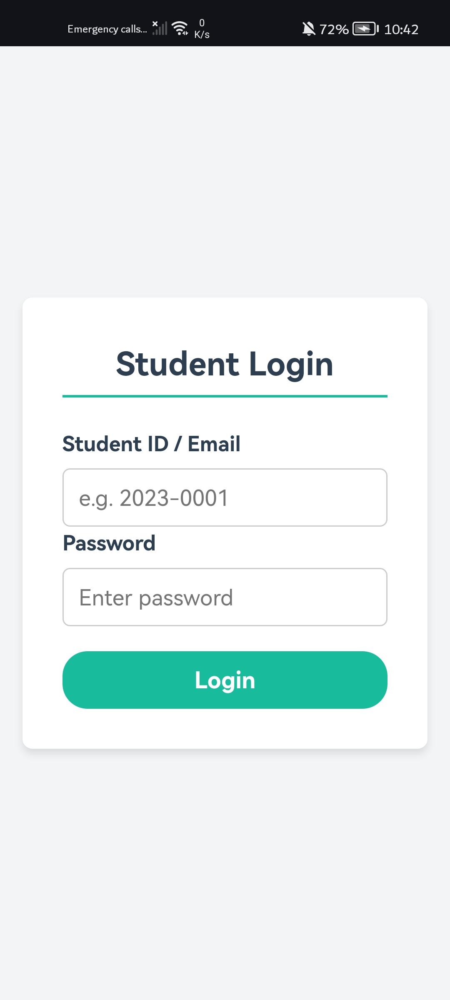
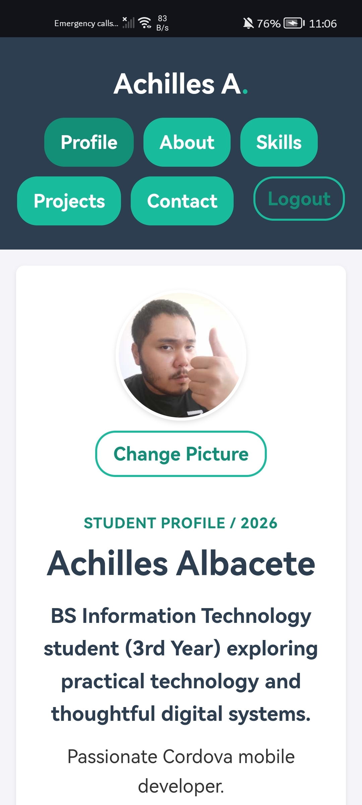
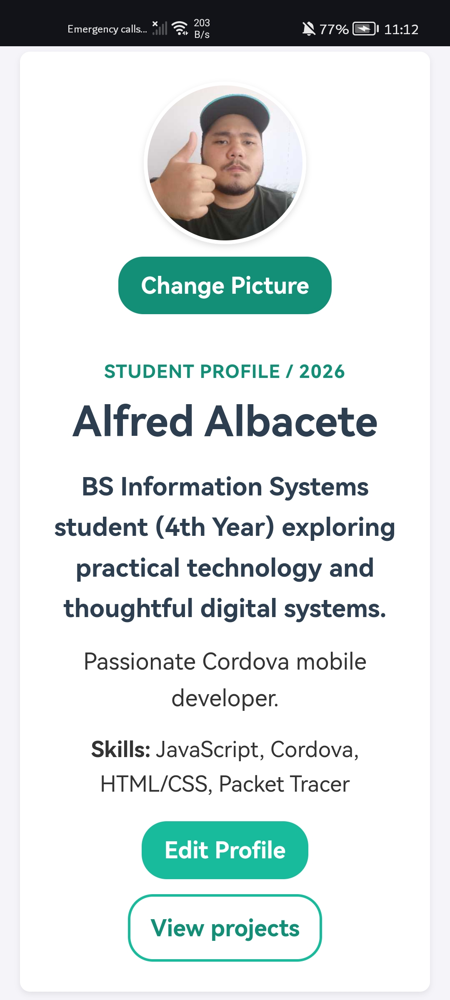

# Achilles Student Profile (Activity 7 )

## 📖 Project Description

This Apache Cordova Android application is a responsive multi-page Student Profile for Achilles A. Albacete, a Bachelor of Science in Information Technology student at Ateneo de Cagayan - Xavier University. 

For **Activity 7**, the application has been upgraded from local storage to a full Client-Server architecture. It now communicates with a custom Node.js/Express.js REST API backed by an SQLite database to handle secure user authentication, data persistence, and remote profile updates (including native camera-based photo uploads).

---

## ⚠️ INSTRUCTOR EVALUATION GUIDE: HOW TO RUN & GRADE

Because this application uses a local Node.js backend, **the mobile app must be configured to point to your computer's local IP address** before building. Please follow these steps to test the app:

### Step 1: Start the Database Server
1. Open a terminal and navigate to the backend server directory (e.g., `cd server`).
2. Run `npm install` to install dependencies (Express, SQLite3, Cors, Bcryptjs).
3. Run `node server.js` to start the backend. The server will run on `http://0.0.0.0:3000`.
*(Note: The SQLite database will automatically create itself and seed a test account upon startup).*

### Step 2: Configure the Mobile App Network
1. Open `www/js/script.js` (or your main frontend JavaScript file).
2. Look for `API_BASE_URL` at the top of the file.
3. **Change the IP address to match your computer's network setup:**
   - **For Physical Devices (Same Wi-Fi):** Use your IPv4 address (e.g., `http://192.168.x.x:3000/api`).
   - **For Android Emulators:** Use `http://10.0.2.2:3000/api`.

### Step 3: Build and Run
1. Open a terminal in the main Cordova project directory.
2. Run `cordova run android` (use `--device` if testing on a physical phone).
3. Log in using the seeded test account:
   - **Student ID:** `2023-0001`
   - **Password:** `password123`

---

## 📱 Application Pages

- **Login/Register:** Authenticates the user against the backend database using their Student ID and hashed password. Supports new student registration.
- **Profile (`index.html`):** Displays the profile summary fetched from the server, the remote profile photo, editable information, and the Camera integration button.
- **About (`about.html`):** Provides personal background, interests, educational background, and goals retrieved dynamically from the database.
- **Skills (`skills.html`):** Describes technical skills, networking, problem-solving, and collaboration skills.
- **Projects (`projects.html`):** Presents academic or personal projects, roles, and technologies used.
- **Contact (`contact.html`):** Provides contact and location information.

## ⚙️ Core Features & API Integration

### Profile Editing
The Profile page includes an **Edit Profile** form. A student can update their full name, course, year level, About Me content, interests, educational background, goals, and skills. 
* **Save Changes:** Validates required fields and sends an asynchronous `PUT /api/profile/:id` request to the Express backend. Upon a successful `200 OK` response, the app refreshes the visible content immediately.
* **Cancel:** Closes the form without applying unsaved edits.

### Native Camera Integration
The application utilizes the physical Android device camera via `cordova-plugin-camera`. Pressing **Change Picture** calls the Cordova camera API with the following parameters:
- **Source:** Camera hardware (not the photo library)
- **Format:** JPEG encoding, Quality 50, 500x500 target size
- **Orientation:** Corrected device orientation
- **Output:** Base64 data returned directly to the application

*Data Flow:* The Base64 image string is included in the JSON payload sent to the backend API and stored directly in the `profile_picture` column of the SQLite `students` table, completely replacing local storage.

### Client-Server Data Persistence
Activity 7 entirely replaces `localStorage` with a centralized backend database:
- **Database:** Uses `sqlite3` to store student records, ensuring data persists across multiple devices or app reinstalls.
- **Authentication:** Uses `bcryptjs` on the backend to securely hash passwords. The frontend sends login credentials via `POST /api/login`.
- **Security:** API endpoints are structured to safely handle Android `usesCleartextTraffic` configurations for local network testing.

### Error Handling & UX
- **Authentication Errors:** Captures `401 Unauthorized` responses for incorrect credentials and displays user-friendly alerts.
- **Network Failures:** Catches `fetch()` promise rejections if the Node.js server is offline/unreachable.
- **Hardware Checks:** Displays appropriate messages if camera permissions are denied.
- **Form Validation:** Prevents empty submissions and focuses the user on invalid fields before attempting API requests.

## 🎨 Responsive Design

The shared `www/style.css` stylesheet utilizes a mobile-first layout, flexible grids, relative spacing, and responsive breakpoints. Pages adapt seamlessly to phone, tablet, and desktop screens without horizontal scrolling, overlapping content, distorted images, or cut-off text.

---

## 📸 Screenshots (Activity 7)

The following screenshots demonstrate the client-server interaction, authentication, and remote database persistence on a physical device:

  
*The new authentication screen verifying credentials against the Express API.*

  
*Profile page populated dynamically by a `GET /api/profile/:id` request to the SQLite database.*

  
*Profile page after successfully submitting a `PUT` request with edited text and a newly captured Base64 camera image.*

---

## 🚀 Deployment Checklist for Activity 7

1. Start Node.js backend server (`node server.js`).
2. Run the `activity-7-backend` branch on a physical device (`cordova run android --device`).
3. Capture Login page (`activity7_SS/Act7_Login.jpg`).
4. Log in and capture loaded profile data (`activity7_SS/Act7_FetchedProfile.jpg`).
5. Tap **Change Picture** and **Edit Profile**, save changes, and capture the updated screen (`activity7_SS/Act7_UpdatedProfile.jpg`).
6. Commit all backend code, frontend code, and images.
7. Merge `activity-7-backend` into `main`, and push to GitHub.

*(Developer Note: If encountering `EBUSY` locked file errors when switching test devices on Windows, run `cordova clean android` or use the `--gradleArg=--no-daemon` flag during the build).*

---

### 📂 Previous Activity References
- **Activity 6 Captures:** `activity6_SS/`
- **Activity 5 Captures:** `activity5_SS/`
- **Activity 4 Captures:** `activity4_SS/`
- **Activity 3 Responsive References:** `activity3_SS/`